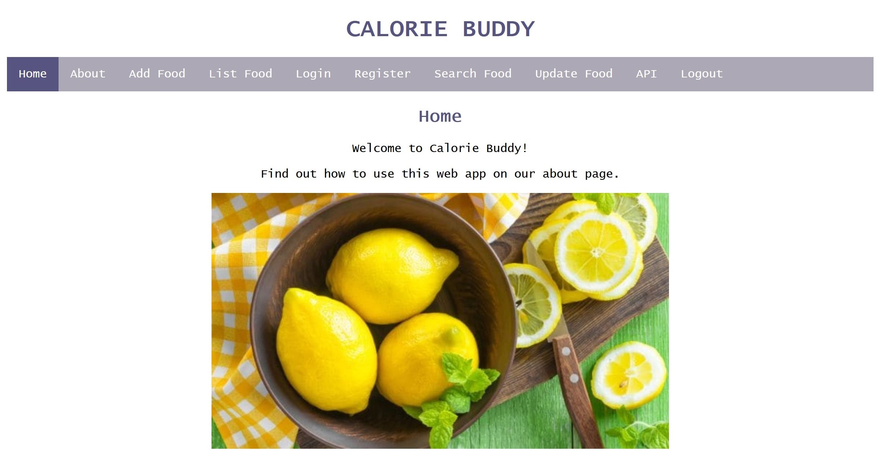

## Calorie Buddy 

### Project Description 

Grade: 94% 

During my second year at university, I developed a dynamic web application using JavaScript, Node.js, and Express.js.

This web app uses MongoDB to store nutritional information about food items, allowing users to add items to help calculate their calorie intake.  

### Access Project

You can access this application [here](http://doc.gold.ac.uk/usr/343/).

The implementation for this project can be found [here](https://github.com/ysmnpksy/calorieBuddy).

