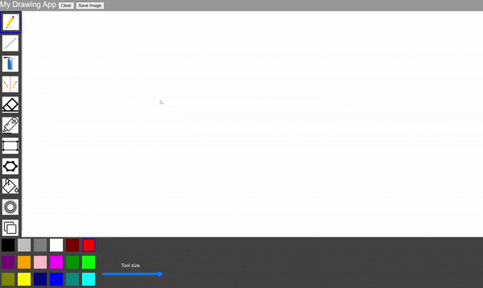
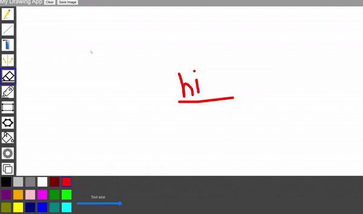
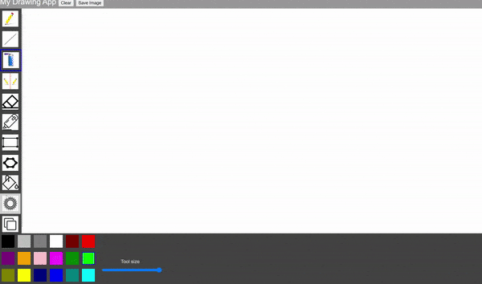
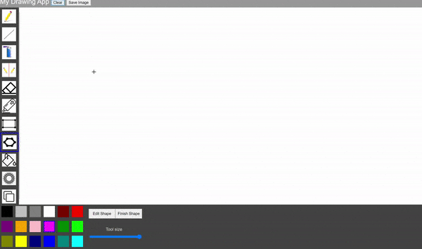

## Drawing Application Project 

### Project description
During my first year at university, working in a pair, we made a drawing application using JavaScript and the p5.js library. 

### Access Project

You can try the application yourself [here](http://igor.gold.ac.uk/~ypaks001/drawingApp/).

You can find the code on my [GitHub](https://github.com/ysmnpksy/drawing_application).

### Project Report

You can find our project report and progress log [here](pdf/DrawingAppReport.pdf).

### Demo

