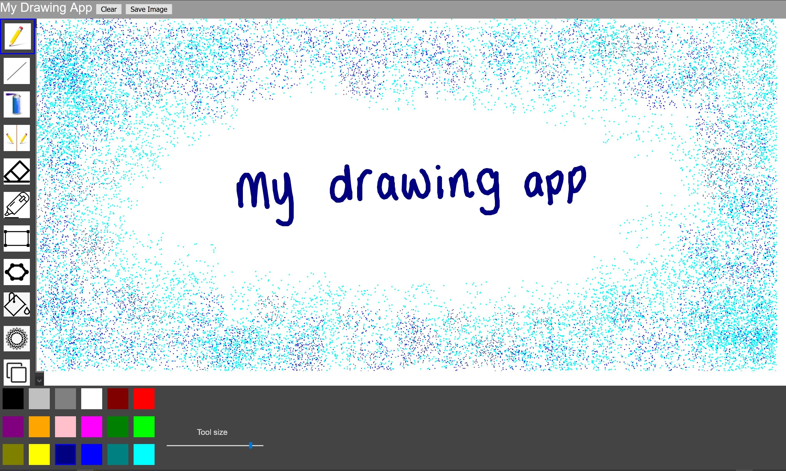
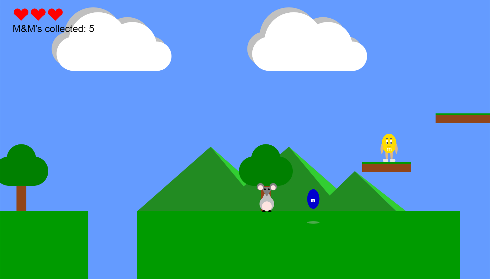

## Portfolio

---

### My Projects

[Splitsy: Bill Splitting Application Proposal](/splitsy)
2020

*Abstract:* Online payment applications are very useful as people can make payments in an efficient and systematic way. In a world more and more focused on privacy we have noticed a lack of bill splitting applications privacy orientated. The purpose of the project was to plan, analyse and gather information to build a secure and user-friendly bill-splitting application. The proposal also focuses on design as well, with the use of techniques that would improve the overall system security and reliability.

---

[Drawing Application Project](/drawing_app)
2020

---
[M&M Game Project](/m&m_game)
2019

---
[Baking Bad Website](/baking_bad)
2019

---
[Westeros Park Website](/westerosPark)
2019

---

### Other Projects 

- [Password Generator](https://github.com/ysmnpksy/passwordGenerator)

---

Page template forked from <a href="https://github.com/evanca/quick-portfolio">evanca</a>

<!-- Remove above link if you don't want to attibute -->
