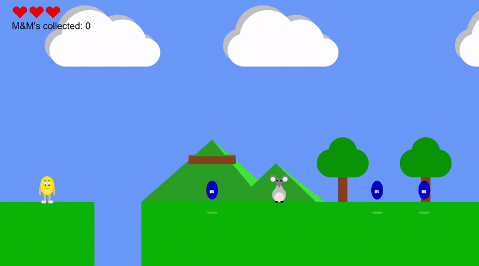
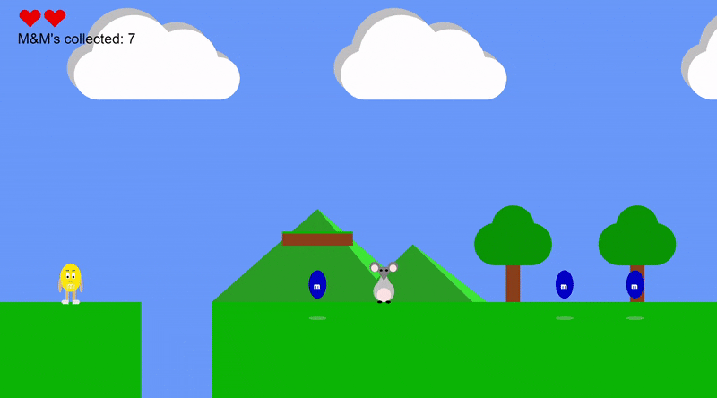

## M&M Game

### Project description
During my first year at university, I made this game inspired by M&M's using JavaScript and the p5.js library. 

Have a go yourself [here](http://igor.gold.ac.uk/~ypaks001/FinalGameProject/).

You can find the code on my [GitHub](https://github.com/ysmnpksy/m-m_game).

### Project Report

You can find our project report and progress log [here](pdf/DrawingAppReport.pdf).

### Demo

