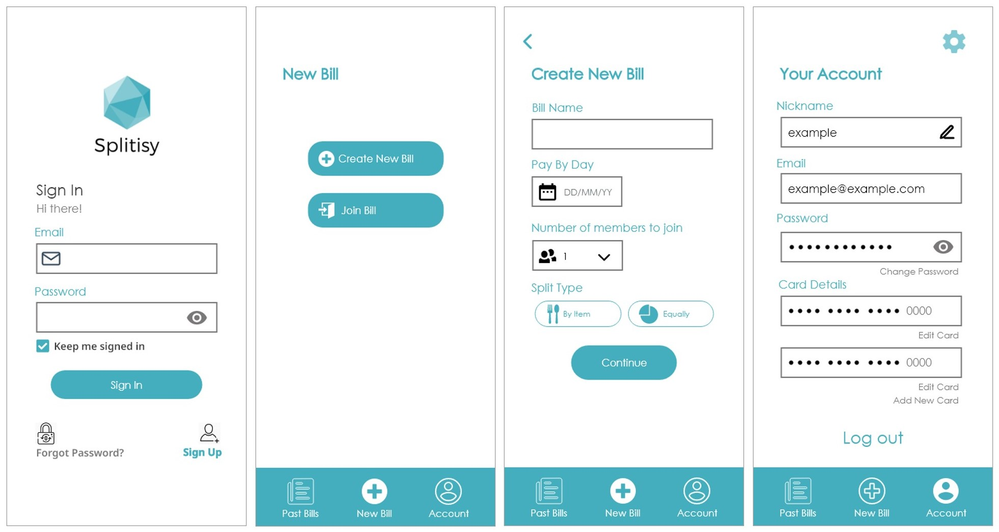

## Splitsy Project Proposal 

### Project description
During my second year at university, myself and a team of students worked on a project proposal for a bill splitting application 'Splitsy'.

We are currently working on the implmentation of this project. 

### Report 
You can look at our proposal [here](pdf/SplitsyProjectProposal). 

### Prototype
During research for our implmentation we created a high-fidelity prototype on Adobe XD, which you can see [here](https://xd.adobe.com/view/38b5d39b-8a68-437c-ab58-d9a07ba6a6fe-6de6/?fullscreen&hints=off).

