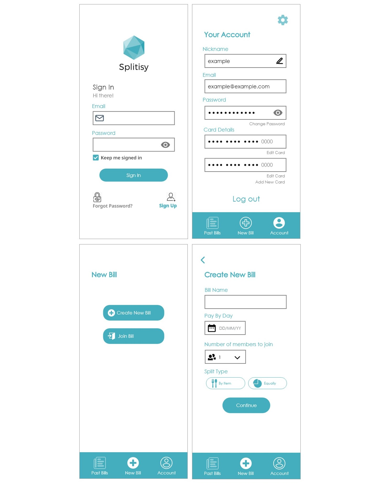

## Splitsy Project Proposal 

### Project description
During my second year at university, myself and a team of students worked on a project proposal for a bill splitting application 'Splitsy'.

**You can look at our proposal [here](pdf/SplitsyProjectProposal.pdf).**

We are currently working on the implmentation of this project. 

### Report Abstract
Online payment applications are very useful as people can make payments in an efficient and systematic way. In a world more and more focused on privacy we have noticed a lack of bill splitting applications privacy orientated. The purpose of the project was to plan, analyse and gather information to build a secure and user-friendly bill-splitting application. The proposal also focuses on design as well, with the use of techniques that would improve the overall system security and reliability.

We have explored the existing bill splitting applications, their features, weaknesses, and possible solutions. Additionally, we researched about demographics and the different types of data related to the subject. Important design methods such as UML and use cases were also analysed along several relevant tools and technologies needed for the development of this app. Online surveys were conducted on different stages in order to gather vital information and timed tests to measure app’s navigation, accessibility, and functionality.

The results revealed that most of the participants approved the layout, colour scheme, navigation, functionality, and importance of the application. Through the numerous feedbacks received, we performed changes on the prototype. Moreover, based on the final online survey, we confirmed that our changes improved the application and users valued the applications user friendliness and reliability.

All the research, surveys and results have proved the importance and need of building a privacy focused and user-friendly application to enhance user experience.

### Prototype
During research for our implmentation we created a high-fidelity prototype on Adobe XD, which you can see [here](https://xd.adobe.com/view/38b5d39b-8a68-437c-ab58-d9a07ba6a6fe-6de6/?fullscreen&hints=off).

